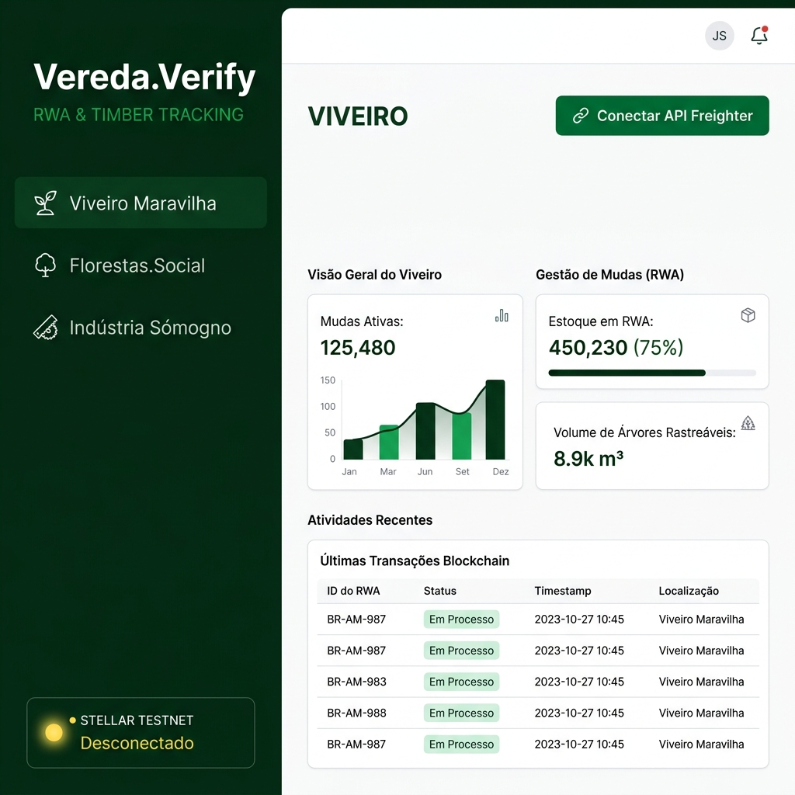

# Vereda.Verify — RWA & Timber Tracking on Stellar

<div align="center">

**A blockchain-powered audit panel for tokenizing sustainable timber assets on the Stellar Network.**

[](https://stellar.org)
[](https://react.dev)
[](https://www.typescriptlang.org)
[](https://vite.dev)
[](LICENSE)

</div>

---

## Overview

**Vereda.Verify** is a professional-grade RWA (Real World Asset) audit dashboard built for the [Florestas.Social](https://florestas.social) protocol. It enables the tokenization and on-chain registration of African Mahogany (*Khaya senegalensis*) assets across the full timber supply chain — from nursery to sawmill — by anchoring cryptographic data payloads to immutable Stellar transactions.

Each registered asset produces a **public, verifiable certificate** on the blockchain that any auditor, regulator, or buyer can inspect without trusting any intermediary.

---

## ✅ Live Transaction — Proof of Concept

> A real asset tokenization was successfully submitted to **Stellar Testnet** during development.

| Field | Value |
|-------|-------|
| **Module** | 🌱 Viveiro Maravilha (Nursery) |
| **Asset** | *Khaya senegalensis* — 5,000 seedlings |
| **Responsible** | CREA-CE-12345/D — Carlos Silva |
| **Lot ID** | MOG-VIV-26-001 |
| **Network** | Stellar Testnet |
| **Status** | ✅ Confirmed & Immutable |
| **TX Hash** | `568292a30444fb2629c592eb4e7c2058cfdd653e6734d90ba05b518a7f2b4c8a` |

🔍 **[View Public Certificate on Stellar Expert →](https://stellar.expert/explorer/testnet/tx/568292a30444fb2629c592eb4e7c2058cfdd653e6734d90ba05b518a7f2b4c8a)**

---

## Features

### 🌱 Three-Module Supply Chain Coverage

| Module | Entity | What Gets Registered |
|--------|--------|---------------------|
| **Viveiro** | Viveiro Maravilha (Nursery) | Seed lot ID, seedling count, CREA engineer, certificates hash |
| **Plantio** | Florestas.Social (Farm) | CAR registration, GPS coordinates, planted area (hectares) |
| **Serraria** | Indústria Sómogno (Sawmill) | Incoming timber NF-e, operating license (LO), outgoing NF-e, buyer info, volume (m³) |

### 🔐 Cryptographic Integrity
- All form data is compressed into a **Merkle-style cryptographic payload** before being embedded in the transaction memo
- Raw data is **never stored in the clear** on-chain — only its fingerprint
- Each transaction includes a structured reference: `VV-{MODULE}-{HASH}` for easy auditing

### 🌐 Smart Network Detection
- Auto-detects the Freighter wallet's active network (**Testnet** or **Mainnet**)
- Queries the correct **Horizon API** endpoint automatically — no hardcoded URLs
- **Balance auto-refreshes** every 15 seconds with 7-decimal Stellar-native precision
- Manual refresh button (↻) always available

### 💼 Wallet Integration (Freighter API v6)
- Full **Freighter API v6** support with proper breaking-change handling
- One-click connect, sign, and broadcast flow
- Error messages surface directly in the UI (no silent failures)

---

## Screenshots

<table>
  <tr>
    <td align="center"><b>Disconnected</b></td>
    <td align="center"><b>Viveiro Module</b></td>
  </tr>
  <tr>
    <td></td>
    <td></td>
  </tr>
  <tr>
    <td align="center"><b>Plantio Module</b></td>
    <td align="center"><b>Serraria Module</b></td>
  </tr>
  <tr>
    <td></td>
    <td></td>
  </tr>
  <tr>
    <td colspan="2" align="center"><b>✅ Successful Tokenization</b></td>
  </tr>
  <tr>
    <td colspan="2" align="center"></td>
  </tr>
</table>

---

## Tech Stack

| Layer | Technology |
|-------|-----------|
| **Frontend** | React 19 + TypeScript 6 |
| **Build Tool** | Vite 8 (with HMR) |
| **Blockchain** | Stellar Network (Testnet / Mainnet) |
| **Wallet** | Freighter API v6 |
| **Stellar SDK** | @stellar/stellar-sdk v15 |
| **Styling** | CSS-in-JS (inline styles) |

---

## Getting Started

### Prerequisites

- [Node.js](https://nodejs.org/) v18+
- [Freighter Wallet](https://freighter.app) browser extension
- A funded Stellar Testnet account → use the [Stellar Friendbot](https://laboratory.stellar.org/#account-creator?network=test)

### Installation

```bash
# Clone the repository
git clone https://github.com/G0vermind/vereda-verify-soroban.git
cd vereda-verify-soroban/painel

# Install dependencies
npm install

# Start the development server
node node_modules/vite/bin/vite.js --port 8080
```

Open **http://localhost:8080** in your browser.

> **Note (Windows):** If `npm run dev` fails with a PowerShell execution policy error, use `node node_modules/vite/bin/vite.js` directly.

### Usage

1. **Install Freighter** — get the browser extension at [freighter.app](https://freighter.app)
2. **Switch to Testnet** — in Freighter settings, select Stellar Testnet
3. **Fund your wallet** — use the [Friendbot](https://laboratory.stellar.org/#account-creator?network=test)
4. **Connect** — click **"🔗 Conectar API Freighter"** in the top-right corner
5. **Select a module** — choose Viveiro, Plantio, or Serraria from the sidebar
6. **Fill in the form** — enter the asset data for the selected stage
7. **Register** — click **"🛡️ ASSINAR E REGISTRAR ATIVO"** to sign and broadcast
8. **View certificate** — click **"🔍 Ver Certidão Pública"** to inspect the on-chain record

---

## Architecture

```
vereda-verify-soroban/
└── painel/
    ├── src/
    │   ├── App.tsx          # Main component — UI, state, and blockchain logic
    │   ├── main.tsx         # React entry point
    │   ├── App.css          # Component-scoped styles
    │   └── index.css        # Global reset (light-mode enforced, input fixes)
    ├── vite.config.ts       # Buffer polyfill for Stellar SDK in browser
    ├── tsconfig.app.json    # TypeScript configuration
    └── package.json         # Dependencies
```

### Transaction Flow

```
User fills form  →  Merkle hash generated (btoa compression)
        ↓
TransactionBuilder creates payment tx
  memo: "VV-{MODULE}-{HASH}"
        ↓
Freighter signs the XDR
  → Returns { signedTxXdr }
        ↓
Horizon broadcasts
  → Returns { hash }
        ↓
Explorer link displayed
  → Public certificate available forever
```

---

## Key Technical Notes

### Freighter API v6 — Breaking Changes Handled

This project uses Freighter API **v6.0.1**, which introduced breaking changes from v5:

```typescript
// ✅ Correct v6 usage
const { isConnected } = await isConnected();      // object, not boolean
const { address } = await requestAccess();         // object, not string
const { signedTxXdr } = await signTransaction(xdr, {
  networkPassphrase: passPhrase                    // 'network' field removed in v6
});
```

### Buffer Polyfill (Required for Stellar SDK in browser)

```typescript
// vite.config.ts
export default defineConfig({
  define:       { global: 'globalThis' },
  resolve:      { alias: { buffer: 'buffer/' } },
  optimizeDeps: { include: ['buffer'] },
})
```

---

## Roadmap

- [ ] SHA-256 real hashing via Web Crypto API (replace `btoa` simulation)
- [ ] IPFS integration for off-chain document storage
- [ ] Soroban smart contract for on-chain registry validation
- [ ] Multi-signature support for multi-party asset approval
- [ ] Mainnet deployment
- [ ] PDF certificate export from transaction hash

---

## Related Projects

- **[Florestas.Social Protocol](https://github.com/G0vermind/social-forests-protocol)** — The broader RWA tokenization protocol for sustainable forestry
- **RWA Vault Contract** — SEP-41 compliant Soroban smart contract for African Mahogany tokenization

---

## License

MIT © 2026 Florestas.Social / Vereda Protocol

---

<div align="center">

Built with 🌱 for sustainable forestry and transparent supply chains.

**[Stellar Expert TX](https://stellar.expert/explorer/testnet/tx/568292a30444fb2629c592eb4e7c2058cfdd653e6734d90ba05b518a7f2b4c8a)** · **[Freighter](https://freighter.app)** · **[Stellar Network](https://stellar.org)**

</div>
