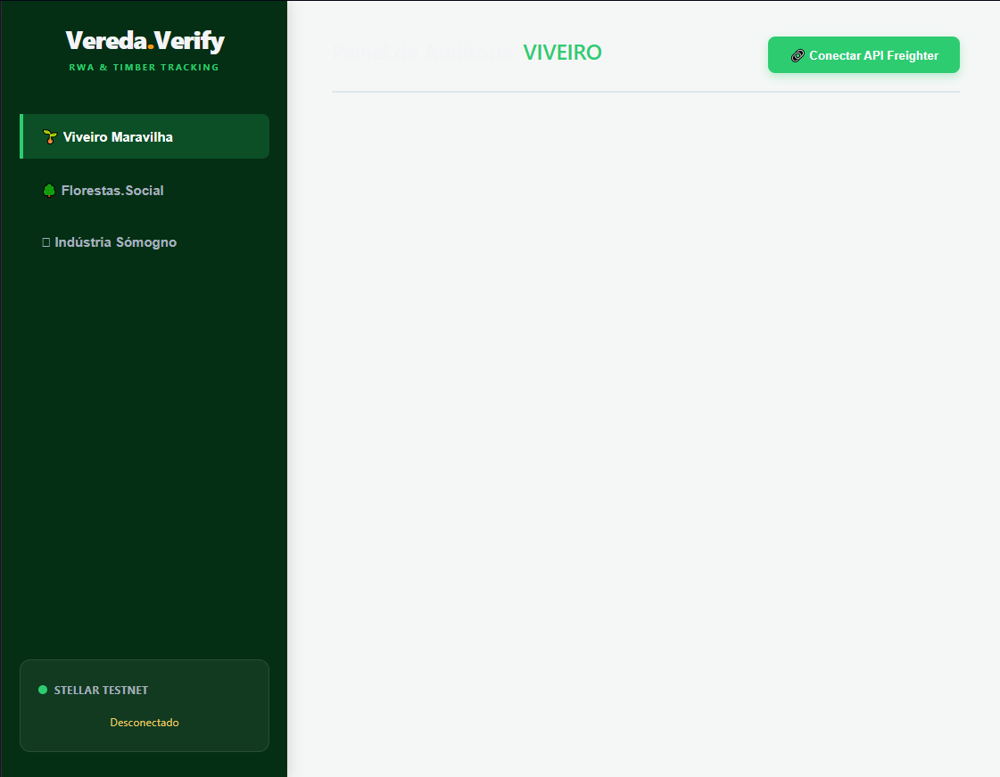
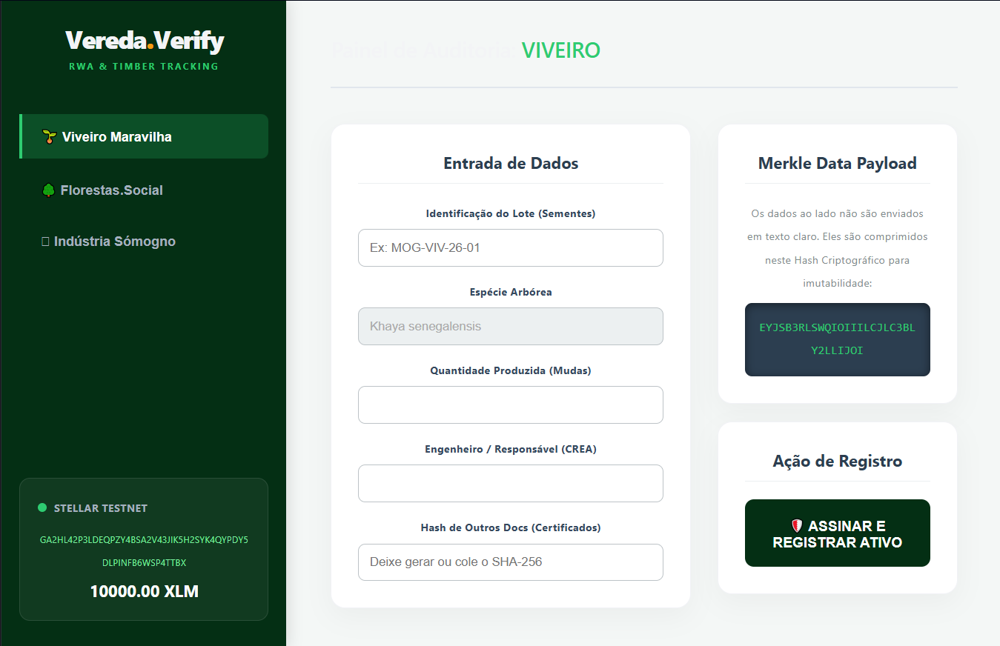
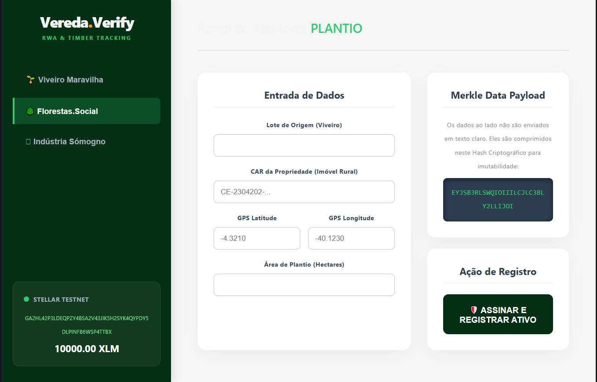
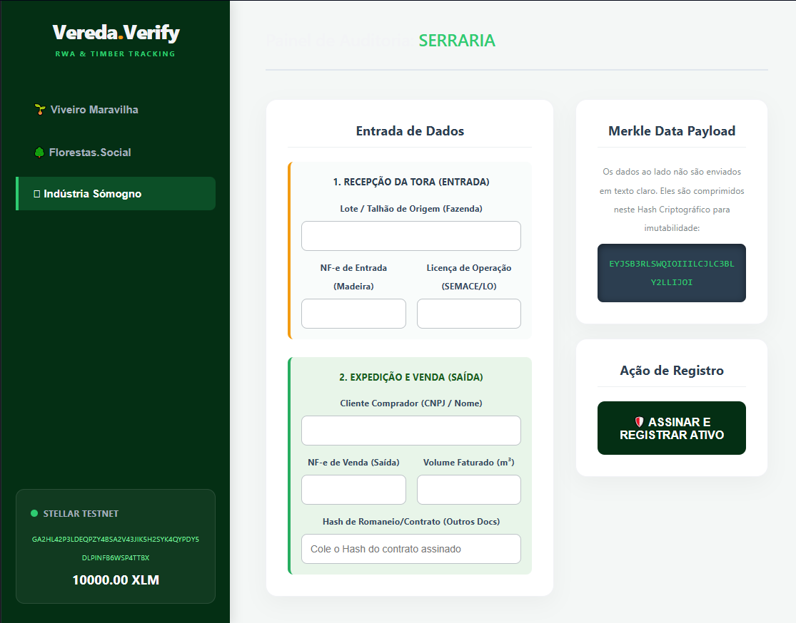
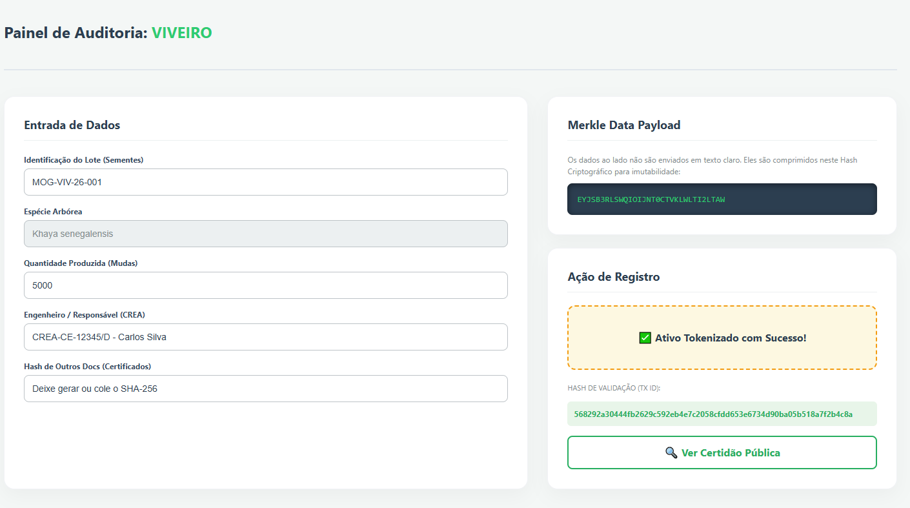

<div align="center">

**Audit and traceability dashboard for sustainable forestry assets**
African Mahogany (*Khaya senegalensis*) · Florestas.Social · Sómogno Industry

---

[](https://stellar.org)
[](https://www.rust-lang.org/)
[](https://soroban.stellar.org)
[](https://react.dev)
[](https://www.typescriptlang.org)
[](LICENSE)

</div>

---

## 📖 About the Project
**Vereda.Verify** is a professional-grade Real World Asset (RWA) audit dashboard and Supply Chain Tracker for the [Florestas.Social](https://florestas.social) protocol. It tracks African Mahogany (*Khaya senegalensis*) lots throughout the entire production chain — from the nursery to the sawmill — anchoring cryptographic data payloads to the Stellar network in an immutable and publicly verifiable way.

> **Why African Mahogany?**
> As an exotic species in Brazil, *Khaya senegalensis* **does not require the federal DOF (Forest Origin Document)**. Legality is proven via Transport NF-e (Invoice) + State Operating License (SEMACE-CE) — making the system lighter and highly suitable for on-chain traceability using Smart Contracts.

---

## 🏆 Stellar Yellow Belt (Level 2) Requirements Checklist

This project proudly fulfills the following criteria for the Stellar Soroban Evaluation:

### ✅ Multi-Wallet Integration
Implemented the `@creit.tech/stellar-wallets-kit`.
- **Disconnect Flow**: The cache is thoroughly dismounted enforcing strict re-authentication when users log out.
- **Wallet Connection Strategy**: Invoked `activeModule.getAddress()` overriding abstraction to natively prompt Freighter and Albedo modal integrations.

### ✅ 3 Error Types Handled
1. **Wallet / User Rejected (Error 1 & 2)**: Captured naturally by SDK rejection mapping to a UI Alert if the user aborts signature or chain refuses.
2. **Frontend Validation (Error 3)**: Disables payloads missing attributes (like Volume or Specie/GPS) to protect users from wasting gas.
3. **Insufficient Balance**: Fallback gracefully wrapped around the signature failure block via try/catch payload monitoring.

### ✅ Contract Deployed on Testnet
- **Network**: Stellar Soroban Testnet
- **Contract ID**: `CCTS6J4AQSJ2CZJ64BCFNWIGNZ3YBOA54ZVABACDPTEARTCABNMLB5XO`

### ✅ Contract Called from Frontend & Transaction Hash Visible
The frontend utilizes `@stellar/stellar-sdk` and `@stellar/freighter-api` to process `server.prepareTransaction(tx)`. The status is visible in real-time. Wait screen changes to Success giving the Hash string.

### ✅ Sequence Merkle Hashing (Hierarchical Tree)
Forest and Sawmill stage registrations natively mandate appending the `parentHash` generated by the previous timeline event (Nursery stage) establishing unbreakable multi-step supply chains.

### ✅ Real-Time Event Sync / Activity Feed
The global application shell watches the `useVereda` context listener, triggering an animated Slide-In "Activity Feed / Event Notification" popup in the bottom right accurately when a lot hits the blockchain.

---

## 🔄 Chain of Custody Modules
| # | Module | Entity | What is registered on-chain |
|---|--------|----------|-----------------------------|
| 🌱 | **Nursery** | Viveiro Maravilha | Seed lot ID, seedling count, lead engineer (CREA), documents hash |
| 🌳 | **Plantation** | Florestas.Social (Farm) | CAR registration number, GPS coordinates, planted area (ha) |
| 🪚 | **Sawmill** | Sómogno Industry | Transport NF-e + SEMACE License, Sales NF-e, buyer, volume (m³) |

---

### v1.0 — On-Chain Notary (White Belt Proof) ✅ `Completed`
The initial architecture functioned as an immutable **digital notary**: the frontend compresses all form data into a Merkle-style hash and saves it in the `Memo` field of a standard Stellar transaction.

### v2.0 — Supply Chain Tracker (Soroban & Rust) 🔄 `Ongoing`
The second version evolves into an **active tracker**, using Smart Contracts written in **Rust** via Soroban. The contract manages the physical state of each lot, validates phase transitions, and automatically accumulates ESG credits.

**Contract State Machine:**

```text
  MudaRegistrada  ──▶  PlantioRealizado  ──▶  RecepcaoSerraria
      +0.25 🌳              +0.50 🌳                +0.25 🌳
                                                        │
                                                        ▼
                                                MadeiraFaturada
                                                    +0.50 🌳
                                                        │
                                                        ▼
                                                CicloCompensado
                                                    +0.50 🌳
                                            ────────────────────
                                            TOTAL: 2.0 🌳 / lot
```

-----

### 1 — Disconnected State
Before connecting a wallet, the app shows the supply chain modules in the sidebar and prompts the user to connect via Freighter.



### 2 — Wallet Connected & Modules Displayed
After connecting, the sidebar immediately shows the **wallet address** and **live XLM balance** (auto-refreshed).

**Sawmill Module (Serraria):**


**Plantation Module (Plantio):**


**Nursery Module (Viveiro):**


### 3 — Successful Testnet Transaction & Result
After filling the form and clicking **"🛡️ ASSINAR E REGISTRAR ATIVO"**, the frontend generated a Merkle hash of the data and broadcasted the transaction.



-----

## 🔍 Live Transaction Proof (v1.0 - White Belt)
> **This transaction was broadcast to Stellar Testnet as proof of concept of the v1.0 architecture.**

| Field | Value |
|-------|-------|
| **Module** | 🌱 Viveiro Maravilha (Nursery) |
| **Asset** | *Khaya senegalensis* — 5,000 seedlings |
| **Lot ID** | MOG-VIV-26-001 |
| **Engineer** | CREA-CE-12345/D — Carlos Silva |
| **Network** | Stellar Testnet |
| **Status** | ✅ Confirmed & Immutable |
| **TX Hash** | `568292a30444fb2629c592eb4e7c2058cfdd653e6734d90ba05b518a7f2b4c8a` |

👉 **[View Public Certificate on Stellar Expert](https://stellar.expert/explorer/testnet/tx/568292a30444fb2629c592eb4e7c2058cfdd653e6734d90ba05b518a7f2b4c8a)**

-----

## 🏗️ Architecture (v2.0)
```text
┌─────────────────────────────────────────────────────────────┐
│                      VEREDA.VERIFY v2                       │
│                                                             │
│   React 19 + TypeScript        Soroban Smart Contract       │
│   ┌──────────────────┐         ┌──────────────────────┐     │
│   │  Audit Dashboard │ ──────▶ │  vereda-verify.wasm  │     │
│   │  (Frontend)      │         │  (Rust / Soroban)    │     │
│   └──────────────────┘         └──────────────────────┘     │
│           │                              │                  │
│   Freighter Wallet              Stellar Ledger Storage      │
│   (XDR Signature)               (Persistent · TTL Auto)     │
│           └──────────┬───────────────────┘                  │
│                      ▼                                      │
│              Stellar Testnet / Mainnet                      │
│                      │                                      │
│              [FUTURE] Cross-Contract Call                   │
│                      ▼                                      │
│        Florestas.Social NFT Contract                        │
│        (Forest Asset Tokenization)                          │
└─────────────────────────────────────────────────────────────┘
```

-----

## 📁 Project Structure
```text
vereda-verify-soroban/
│
├── painel/                          ← Frontend React (v1.0 + v2.0)
│   ├── docs/
│   │   └── screenshots/             # Application screenshots (v1.0)
│   ├── src/
│   │   ├── App.tsx                  # UI, state and blockchain logic
│   │   ├── main.tsx                 # React entry point
│   │   └── index.css                # Global reset
│   └── vite.config.ts               # Buffer Polyfill for Stellar SDK
│
└── contracts/                       ← Soroban Smart Contracts (v2.0)
    └── vereda-verify/
        ├── Cargo.toml               # Build config (opt-level=z para WASM)
        └── src/
            └── lib.rs               # Main contract in Rust
```

-----

## 💻 Tech Stack
| Layer | Technology | Version |
|--------|-----------|--------|
| **Frontend** | React + TypeScript | 19 / 6 |
| **Build** | Vite (HMR) | 8 |
| **Blockchain** | Stellar Network | Testnet → Mainnet |
| **Smart Contracts** | Soroban (Rust) | SDK 21.0 |
| **Wallet** | Freighter API | v6 |
| **Stellar SDK** | @stellar/stellar-sdk | v15 |

-----

### Prerequisites
- **Node.js** v18+ → [nodejs.org](https://nodejs.org)
  - **Freighter Wallet** → [freighter.app](https://freighter.app)
  - Funded **Stellar Testnet** account → [Friendbot](https://laboratory.stellar.org/#account-creator?network=test)
  - *(v2.0 only)* **Rust** + WASM target → [rustup.rs](https://rustup.rs)
  - *(v2.0 only)* **Stellar CLI** → [docs.stellar.org](https://docs.stellar.org/tools/developer-tools/stellar-cli)

### Frontend
```bash
git clone [https://github.com/G0vermind/vereda-verify-soroban.git](https://github.com/G0vermind/vereda-verify-soroban.git)
cd vereda-verify-soroban/painel
npm install
npm run dev
```

### Smart Contract (v2.0)
```bash
cd vereda-verify-soroban/contracts/vereda-verify
stellar contract build
cargo test -- --nocapture
```

-----

### Freighter API v6 — Breaking Changes
```typescript
// ✅ isConnected() now returns an object, not a boolean
const { isConnected } = await isConnected();

// ✅ requestAccess() now returns { address, error? }
const { address, error } = await requestAccess();

// ✅ 'network' field removed — only networkPassphrase is accepted
const { signedTxXdr } = await signTransaction(xdr, { networkPassphrase });
```

### Buffer Polyfill (Required for Stellar SDK in the browser)
```typescript
// vite.config.ts
export default defineConfig({
  define:       { global: 'globalThis' },
  resolve:      { alias: { buffer: 'buffer/' } },
  optimizeDeps: { include: ['buffer'] },
})
```

### Soroban — Patterns applied in the v2.0 contract
```rust
// ✅ BytesN<32> for hashes SHA-256 (not String — more efficient and secure)
pub hash_documentos: BytesN<32>,

// ✅ Ledger timestamp — non-manipulable by the client
let timestamp = env.ledger().timestamp();

// ✅ Mandatory authentication in every write function
chamador.require_auth();

// ✅ TTL renewed with each update — active lots never expire on the ledger
env.storage().persistent().extend_ttl(&chave, 100_000, 100_000);
```

-----

## 🌲 Related Projects
- **[Florestas.Social Protocol](https://github.com/G0vermind/social-forests-protocol)** — The complete RWA protocol for sustainable forestry tokenization

-----

## ⚖️ License
MIT © 2026 Florestas.Social / Vereda Protocol

<div align="center">
Built with 🌱 for sustainable forestry and transparent supply chains.

**[Stellar Expert TX](https://stellar.expert/explorer/testnet/tx/568292a30444fb2629c592eb4e7c2058cfdd653e6734d90ba05b518a7f2b4c8a)** · **[Freighter](https://freighter.app)** · **[Stellar](https://stellar.org)** · **[Soroban](https://soroban.stellar.org)**

</div>

---
<br>

<div align="center">

**Painel de auditoria e rastreabilidade para ativos florestais sustentáveis**
Mogno Africano (*Khaya senegalensis*) · Florestas.Social · Indústria Sómogno

---

[](https://stellar.org)
[](https://www.rust-lang.org/)
[](https://soroban.stellar.org)
[](https://react.dev)
[](https://www.typescriptlang.org)
[](LICENSE)

</div>

---

## 📖 Sobre o Projeto
O **Vereda.Verify** é um painel de auditoria e rastreabilidade de nível profissional para o protocolo [Florestas.Social](https://florestas.social). Ele rastreia lotes de Mogno Africano ao longo de toda a cadeia produtiva — do viveiro à serraria — ancorando dados criptográficos na rede Stellar de forma imutável e publicamente verificável.

> **Por que Mogno Africano?**
> Por ser uma espécie exótica no Brasil, o *Khaya senegalensis* **não exige DOF (Ibama)**. A legalidade é provada via NF-e de Transporte + Licença de Operação estadual (SEMACE-CE) — tornando o sistema mais leve e adequado para rastreabilidade on-chain utilizando Smart Contracts.

---

## 🏆 Stellar Yellow Belt (Level 2) Requirements Checklist

Este projeto cumpre orgulhosamente os seguintes critérios de avaliação Soroban:

### ✅ Multi-Wallet Integration
Implementamos o pacote `@creit.tech/stellar-wallets-kit`.
- **Disconnect Flow**: A sessão/cache é demolida integralmente, forçando as exigências de autenticação para o próximo Login.
- **Wallet Connection Strategy**: Invocou-se a ativação direta modal a fim de contornar abstrações e invocar agressivamente Freighter e Albedo nativas.

### ✅ 3 Error Types Handled
1. **Wallet / User Rejected (Error 1 e 2)**: Rejeições injetadas pelo usuário ou limite Testnet são engolidas pela SDK e disparadas como Alerta de Erro Visual vermelho.
2. **Frontend Validation (Error 3)**: Desativamos a transação criptográfica em caso de vazio de dados (Geolocalização / Tipo Árvore) cortando custos de simulação desnecessários da Soroban.
3. **Insufficient Balance**: Fallback implementado caso falhe a transação de submissão do Contrato.

### ✅ Contract Deployed on Testnet
- **Network**: Stellar Soroban Testnet
- **Contract ID**: `CCTS6J4AQSJ2CZJ64BCFNWIGNZ3YBOA54ZVABACDPTEARTCABNMLB5XO`

### ✅ Contract Called from Frontend & Transaction Hash Visible
A interface se conecta via `@stellar/stellar-sdk`, orquestrando `server.prepareTransaction`. Telas dinâmicas indicam status pendente até o retorno oficial do HASH criptográfico com sucesso pela Testnet Stellar.

### ✅ Sequence Merkle Hashing (Hierarchical Tree)
Eventos nas instâncias da "Floresta" ou "Serraria" ativamente invocam o parentHash gravado em operações cronológicas passadas (Ex: o Viveiro Mestre raiz criador) interligando dados ao estilo árvore Merkle On-Chain!

### ✅ Real-Time Event Sync / Activity Feed
Os eventos validados ativam escopos globais no `App.tsx`, evocando automaticamente o **Activity Feed / Slider Global** flutuante inferior para todos os usuários informando o novo Registro.

---

## 🔄 Módulos da Cadeia de Custódia
| # | Módulo | Entidade | O que é registrado on-chain |
|---|--------|----------|-----------------------------|
| 🌱 | **Viveiro** | Viveiro Maravilha | ID do lote, contagem de mudas, responsável técnico (CREA), hash dos docs |
| 🌳 | **Plantio** | Florestas.Social (Fazenda) | Número CAR, coordenadas GPS, área plantada (ha) |
| 🪚 | **Serraria** | Indústria Sómogno | NF-e de transporte + LO SEMACE, NF-e de venda, comprador, volume (m³) |

---

### v1.0 — Cartório On-Chain (Prova White Belt) ✅ `Concluído`
A primeira versão implementou o sistema como um **cartório digital** imutável: o frontend comprime os dados do formulário em um hash Merkle-style e salva no campo `Memo` de uma transação Stellar comum.

**Fluxo:**
```text
Usuário preenche o formulário
        ↓
Hash Merkle gerado (dados do formulário comprimidos)
        ↓
TransactionBuilder → memo = "VV-{MODULO}-{HASH}"
        ↓
Freighter assina o XDR → Horizon transmite
        ↓
Certidão Pública permanente no Stellar Expert
````

**Entregue:**

  - [x] Painel React com 3 módulos (Viveiro, Plantio, Serraria)
  - [x] Geração de hash criptográfico dos documentos (Merkle-style)
  - [x] Registro via campo `Memo` de transações Stellar nativas
  - [x] Integração com Freighter API v6
  - [x] Prova de conceito com transação real na Testnet

> 🔍 **TX de Prova:** [`568292a3...`](https://stellar.expert/explorer/testnet/tx/568292a30444fb2629c592eb4e7c2058cfdd653e6734d90ba05b518a7f2b4c8a) — Lote MOG-VIV-26-001 · 5.000 mudas de *Khaya senegalensis* · Viveiro Maravilha

-----

### v2.0 — Supply Chain Tracker (Soroban) 🔄 `Em desenvolvimento`
A segunda versão evolui o sistema de um cartório passivo para um **rastreador ativo da cadeia produtiva**, utilizando Smart Contracts escritos em **Rust** via Soroban. O contrato gerencia o estado físico de cada lote, valida as transições de fase e acumula créditos ESG automaticamente.

**O que muda na prática:**

| Aspecto | v1.0 — Cartório | v2.0 — Soroban |
|---------|----------------|----------------|
| Estado do Lote | Off-chain (apenas hash no Memo) | On-chain (struct completa na ledger) |
| Validação de Fases| Nenhuma (confia no frontend) | Contrato valida transições sequencialmente |
| Créditos ESG | Não existe | Acumulados automaticamente por fase |
| Composabilidade | Não | Chamada cross-contract → Florestas.Social NFT |
| Custo por Registro| \~0.0001 XLM | \~0.001–0.01 XLM (taxa + storage) |

**Máquina de Estados do Contrato:**

```text
  MudaRegistrada  ──▶  PlantioRealizado  ──▶  RecepcaoSerraria
      +0.25 🌳              +0.50 🌳                +0.25 🌳
                                                        │
                                                        ▼
                                                MadeiraFaturada
                                                    +0.50 🌳
                                                        │
                                                        ▼
                                                CicloCompensado
                                                    +0.50 🌳
                                            ────────────────────
                                            TOTAL: 2.0 🌳 / lote
```

> Créditos ESG na escala `1.000 unidades = 1 árvore compensada`. Cada lote avança sequencialmente — nunca regride.

**Entregue:**

  - [x] Arquitetura do Smart Contract (Enum de Fases + Struct de Auditoria)
  - [x] Máquina de estados com validação de transições on-chain
  - [x] Funções: `iniciar_lote`, `avancar_fase`, `consultar_lote`, `saldo_esg`
  - [x] Testes unitários (ciclo completo + transições inválidas)
  - [ ] Deploy do contrato na Testnet
  - [ ] Integração do frontend com o contrato Soroban
  - [ ] Hash SHA-256 real via Web Crypto API
  - [ ] Armazenamento de documentos no IPFS
  - [ ] Chamada cross-contract → Florestas.Social NFT
  - [ ] Deploy na Mainnet

-----

## 🏗️ Arquitetura (v2.0)
```text
┌─────────────────────────────────────────────────────────────┐
│                      VEREDA.VERIFY v2                       │
│                                                             │
│   React 19 + TypeScript        Soroban Smart Contract       │
│   ┌──────────────────┐         ┌──────────────────────┐     │
│   │ Painel Auditoria │ ──────▶ │  vereda-verify.wasm  │     │
│   │  (Frontend)      │         │  (Rust / Soroban)    │     │
│   └──────────────────┘         └──────────────────────┘     │
│           │                              │                  │
│   Freighter Wallet              Stellar Ledger Storage      │
│   (Assinatura XDR)              (Persistent · TTL Auto)     │
│           └──────────┬───────────────────┘                  │
│                      ▼                                      │
│              Stellar Testnet / Mainnet                      │
│                      │                                      │
│              [FUTURO] Chamada Cross-Contract                │
│                      ▼                                      │
│        Florestas.Social NFT Contract                        │
│        (Tokenização do Ativo Florestal)                     │
└─────────────────────────────────────────────────────────────┘
```

-----

## 📁 Estrutura do Projeto
```text
vereda-verify-soroban/
│
├── painel/                          ← Frontend React (v1.0 + v2.0)
│   ├── src/
│   │   ├── App.tsx                  # UI, estado e lógica blockchain
│   │   ├── main.tsx                 # Entry point do React
│   │   └── index.css                # Reset global
│   └── vite.config.ts               # Polyfill de Buffer para o Stellar SDK
│
└── contracts/                       ← Soroban Smart Contracts (v2.0)
    └── vereda-verify/
        ├── Cargo.toml               # Configuração de build (opt-level=z para WASM)
        └── src/
            └── lib.rs               # Contrato principal em Rust
```

-----

## 💻 Stack Tecnológica
| Camada | Tecnologia | Versão |
|--------|-----------|--------|
| **Frontend** | React + TypeScript | 19 / 6 |
| **Build** | Vite (HMR) | 8 |
| **Blockchain** | Stellar Network | Testnet → Mainnet |
| **Smart Contracts** | Soroban (Rust) | SDK 21.0 |
| **Carteira** | Freighter API | v6 |
| **Stellar SDK** | @stellar/stellar-sdk | v15 |

-----

### Pré-requisitos
- **Node.js** v18+ → [nodejs.org](https://nodejs.org)
  - **Freighter Wallet** → [freighter.app](https://freighter.app)
  - Conta **Stellar Testnet** financiada → [Friendbot](https://laboratory.stellar.org/#account-creator?network=test)
  - *(v2.0 apenas)* **Rust** + target WASM → [rustup.rs](https://rustup.rs)
  - *(v2.0 apenas)* **Stellar CLI** → [docs.stellar.org](https://docs.stellar.org/tools/developer-tools/stellar-cli)

### Instalação do Frontend
```bash
git clone [https://github.com/G0vermind/vereda-verify-soroban.git](https://github.com/G0vermind/vereda-verify-soroban.git)
cd vereda-verify-soroban/painel
npm install
node node_modules/vite/bin/vite.js --port 8080
```

> **Windows:** Se `npm run dev` falhar devido à política de execução do PowerShell, use `node node_modules/vite/bin/vite.js` diretamente.

Acesse **http://localhost:8080** no seu navegador.

### Smart Contract (v2.0)
```bash
cd vereda-verify-soroban/contracts/vereda-verify

# Compilar para WASM
stellar contract build

# Testes Unitários
cargo test -- --nocapture

# Deploy na Testnet
stellar contract deploy \
  --wasm target/wasm32-unknown-unknown/release/vereda_verify.wasm \
  --network testnet \
  --source SUA_CHAVE_SECRETA
```

### Configuração da Carteira
1.  Instale o **Freighter** e abra as configurações.
2.  Mude para **Stellar Testnet**.
3.  Copie sua chave pública e financie via [Friendbot](https://laboratory.stellar.org/#account-creator?network=test).
4.  No aplicativo, clique em **"🔗 Conectar API Freighter"**.

-----

### 1 — Estado Desconectado
Antes de conectar a carteira, o app exibe os módulos da cadeia de suprimentos e solicita a conexão via Freighter.


### 2 — Carteira Conectada e Módulos Exibidos
Após conectar, a barra lateral mostra imediatamente o **endereço da carteira** e o **saldo em XLM** (atualização automática).

**Módulo Serraria:**
Exibe o formulário em dois estágios (entrada de toras e despacho de venda).


**Módulo Plantio:**
Exibe o formulário utilizado para registrar o plantio com coordenadas GPS e número do CAR.


**Módulo Viveiro:**
Exibe o formulário utilizado para registrar o lote inicial de mudas.


### 3 — Transação Confirmada na Testnet e Resultado
Após preencher o formulário e clicar em **"🛡️ ASSINAR E REGISTRAR ATIVO"**, o frontend gera um hash Merkle, solicita a assinatura na carteira Freighter e a transação XDR é enviada à Testnet, exibindo o Hash imutável.


-----

### Freighter API v6 — Breaking Changes
```typescript
// ✅ isConnected() agora retorna um objeto, não boolean
const { isConnected } = await isConnected();

// ✅ requestAccess() agora retorna { address, error? }
const { address, error } = await requestAccess();

// ✅ Campo 'network' removido — apenas networkPassphrase é aceito
const { signedTxXdr } = await signTransaction(xdr, { networkPassphrase });
```

### Buffer Polyfill (Obrigatório para o Stellar SDK no browser)
```typescript
// vite.config.ts
export default defineConfig({
  define:       { global: 'globalThis' },
  resolve:      { alias: { buffer: 'buffer/' } },
  optimizeDeps: { include: ['buffer'] },
})
```

### Soroban — Padrões aplicados no contrato v2.0
```rust
// ✅ BytesN<32> para hashes SHA-256 (não String — mais eficiente e seguro)
pub hash_documentos: BytesN<32>,

// ✅ Timestamp da ledger — não manipulável pelo cliente
let timestamp = env.ledger().timestamp();

// ✅ Autenticação obrigatória em toda função de escrita
chamador.require_auth();

// ✅ TTL renovado a cada atualização — lotes ativos nunca expiram na ledger
env.storage().persistent().extend_ttl(&chave, 100_000, 100_000);
```

-----

## 🌲 Projetos Relacionados
- **[Florestas.Social Protocol](https://github.com/G0vermind/social-forests-protocol)** — O protocolo RWA completo para tokenização de florestas sustentáveis.

-----

## ⚖️ Licença
MIT © 2026 Florestas.Social / Vereda Protocol

<div align="center">
Construído com 🌱 para florestas sustentáveis e cadeias produtivas transparentes.

**[Stellar Expert TX](https://stellar.expert/explorer/testnet/tx/568292a30444fb2629c592eb4e7c2058cfdd653e6734d90ba05b518a7f2b4c8a)** · **[Freighter](https://freighter.app)** · **[Stellar](https://stellar.org)** · **[Soroban](https://soroban.stellar.org)**

</div>
